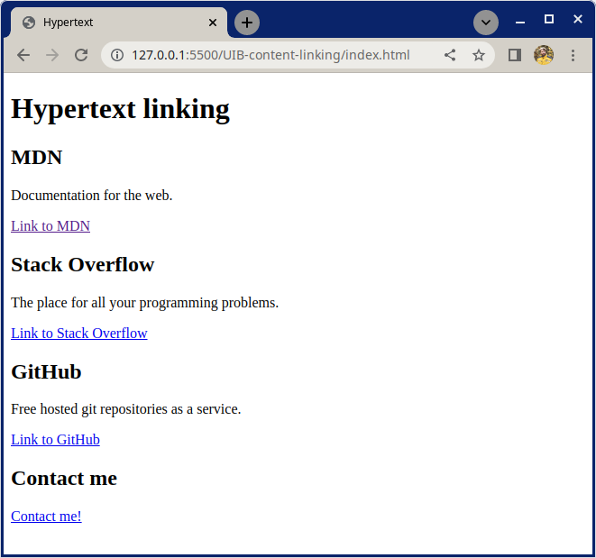

# Hypertext Linking

This exercise is for practicing how to make hyperlinks with the anchor element.

## What you will be doing

Work in the included `index.html`. HTML5 Boilerplate code is already provided in the file. Good luck, have fun!

### Example

## Tasks

### Task 1

- Add an `h1` to give the page a main heading
- For MDN, Stack Overflow and GitHub:
    - Create a `section` and inside it add:
        - An `h2` element with the name of the website you're linking to
        - A `p` with a description of the website you're linking to
        - An `a` element linking to the website

### Task 2

- Create a `section` tag and inside it add_
    - An `h2` element with the text "Contact me"
    - An `a` element that is a "mailto" Email link
        - [Not sure what a mailto link is? See here](https://developer.mozilla.org/en-US/docs/Learn/HTML/Introduction_to_HTML/Creating_hyperlinks#email_links)